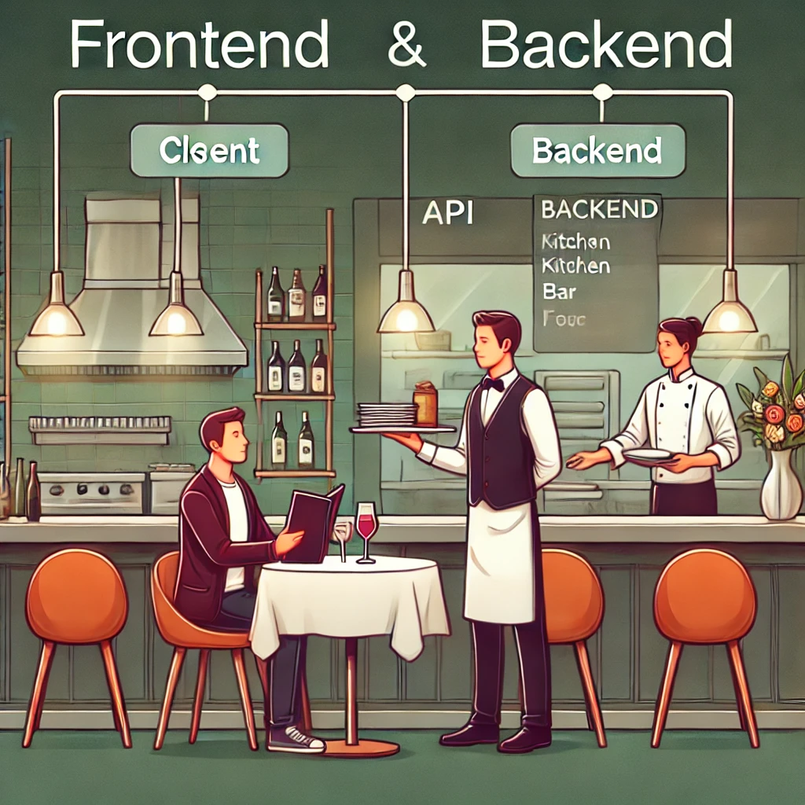
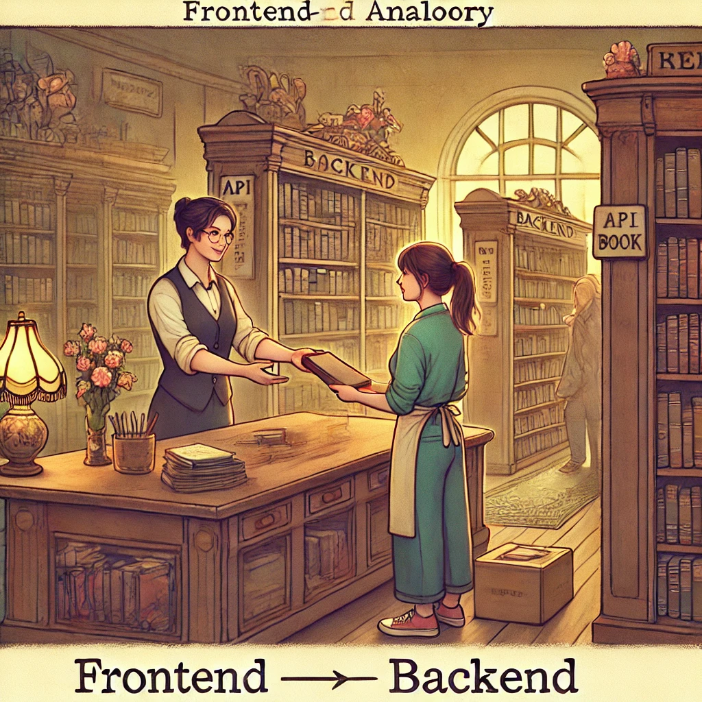

# 06 - o API

## Application Programming Interface

 

## Jakie są rodzaje API?

* **RCP API**: Zaprojektowane tak, żeby wykonać blok kodu na innym
  serwerze/kliencie
* **SOAP API**: Najbardziej ustandaryzowane, oparte na XML, gwarantuje
  wysoki poziom bezpieczeństwa dlatego często jest używane w bankach.
* **Hardware API**
  > 💡 Komunikacja między aparatem w smartfonie a aplikacją
* **System API**
  > 💡 Komunikacja między frameworkiem aplikacji a systemem operacyjnym
* **REST API**

### ⏭️ Następny rozdział: [07 - REST API 🌐](07-rest-api.md)