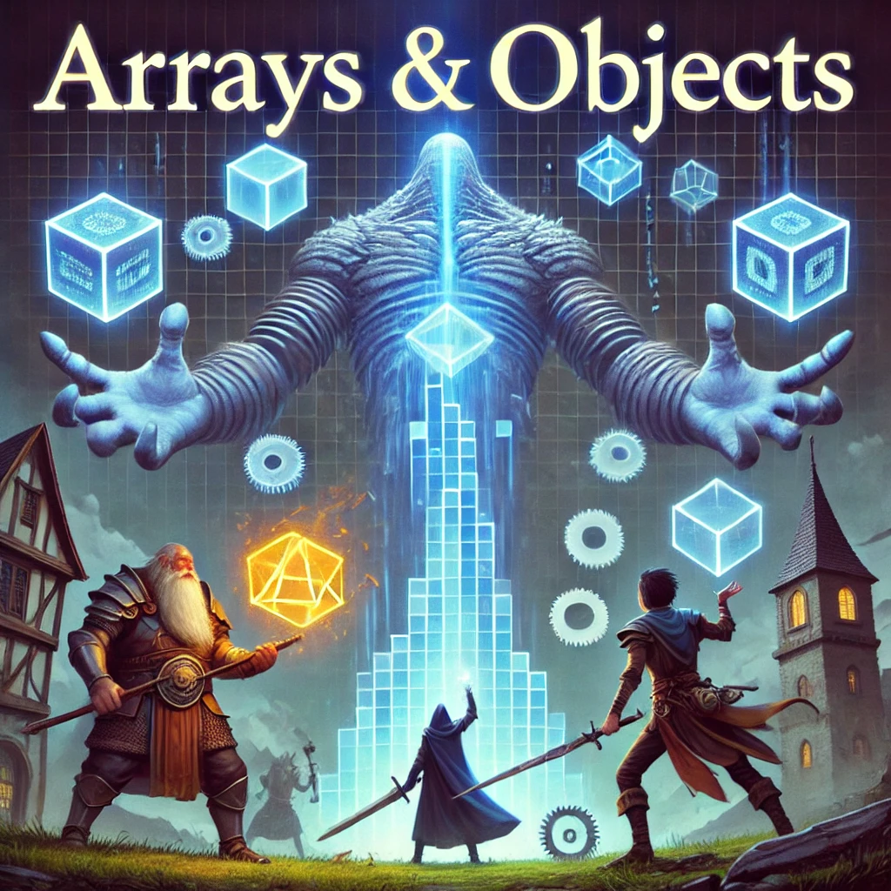

# 12 - Arrays & Objects (Tablice i Obiekty)

<center>



</center>

```json
{
  "klucz": "wartość",
  "key": "value",
  "keyNumber": 1,
  "keyBolean": true,
  "keyString": "string",
  "keyNull": null,
  "keyArray": [],
  "keyObject": {}
}
```

```json
{
  "name": "Thorin",
  "race": "Krasnolud",
  "class": "Wojownik",
  "level": 5,
  "stats": {
    "strength": 18,
    "dexterity": 12,
    "constitution": 16,
    "intelligence": 10,
    "wisdom": 8,
    "charisma": 14
  },
  "equipment": [
    "Topór bojowy",
    "Zbroja płytowa",
    "Tarcza"
  ],
  "abilities": [
    "Potężne Uderzenie",
    "Obrona Tarczą"
  ]
}
```

```json
{
  "name": "Eldrin",
  "race": "Elf",
  "class": "Mag",
  "level": 5,
  "stats": {
    "strength": 8,
    "dexterity": 14,
    "constitution": 10,
    "intelligence": 20,
    "wisdom": 16,
    "charisma": 12
  },
  "equipment": [
    "Kostur Magii",
    "Szata Czarodzieja",
    "Księga Zaklęć"
  ],
  "abilities": [
    "Kula Ognia",
    "Lodowy Pocisk",
    "Tarcza Magiczna"
  ]
}
```

```json
{
  "name": "Sylva",
  "race": "Człowiek",
  "class": "Złodziej",
  "level": 5,
  "stats": {
    "strength": 10,
    "dexterity": 18,
    "constitution": 12,
    "intelligence": 14,
    "wisdom": 12,
    "charisma": 16
  },
  "equipment": [
    "Sztylet",
    "Lekka Zbroja",
    "Wytrychy"
  ],
  "abilities": [
    "Atak z Zaskoczenia",
    "Skradanie się",
    "Unik"
  ]
}
```

```json
{
  "name": "Faelar",
  "race": "Półelf",
  "class": "Łowca",
  "level": 5,
  "stats": {
    "strength": 14,
    "dexterity": 16,
    "constitution": 14,
    "intelligence": 12,
    "wisdom": 18,
    "charisma": 10
  },
  "equipment": [
    "Łuk Dębowy",
    "Kołczan Strzał",
    "Sztylet Myśliwski"
  ],
  "abilities": [
    "Strzał Precyzyjny",
    "Śledzenie",
    "Rozmowa ze Zwierzętami"
  ]
}
```

```json
[
  {
    "name": "Goblin",
    "hp": 7,
    "attack": 5,
    "defense": 12
  },
  {
    "name": "Ogr",
    "hp": 30,
    "attack": 12,
    "defense": 15
  },
  {
    "name": "Smok",
    "hp": 120,
    "attack": 25,
    "defense": 20
  }
]
```
### [Powrót do strony głównej](../../README.md)